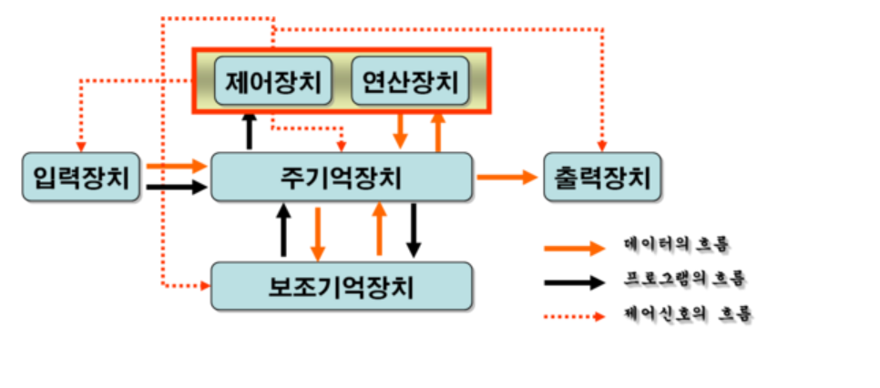
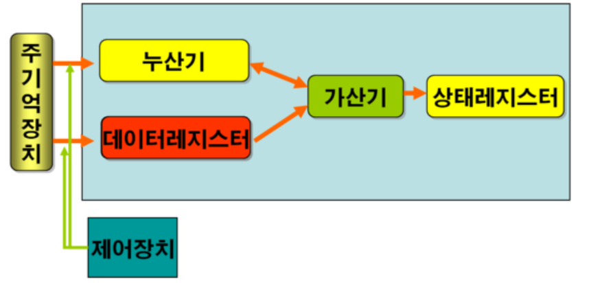
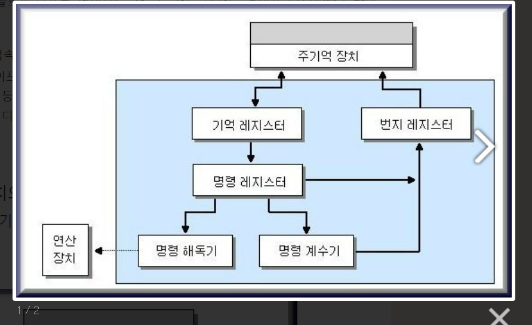
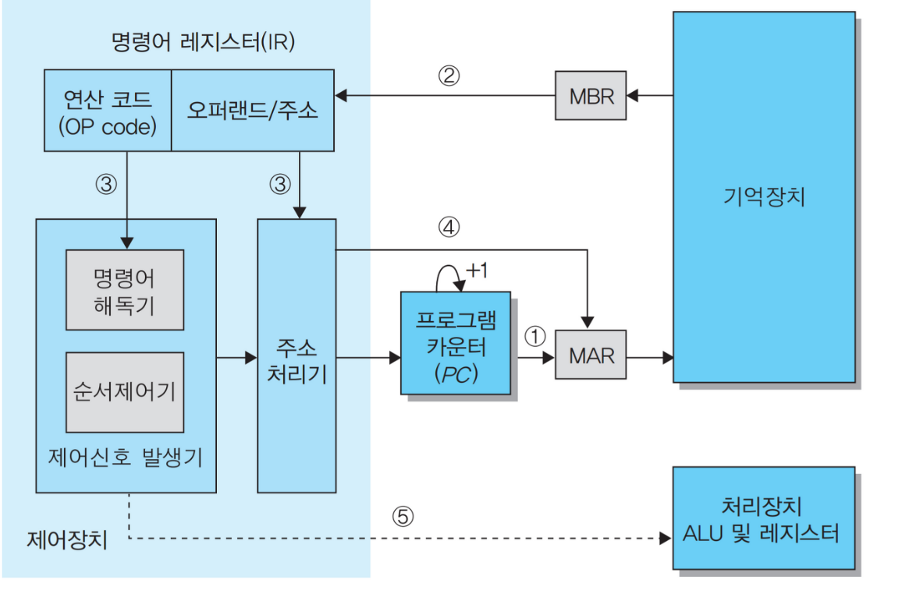
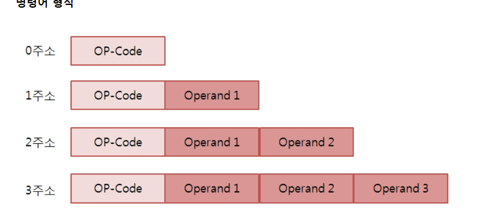

# 중앙처리장치(CPU) 

## CPU의 동작 구조

1. 주기억장치는 입력장치에서 입력받은 데이터 또는 보조기억장치에 저장된 프로그램 읽음
2. CPU는 프로그램을 실행하기 위해 주기억장치에 저장된 프로그램 명령어와 데이터를 읽어와 처리하고 결과를 다시 주기억장치에 저장
3. 주기억장치는 처리 결과를 보조기억장치에 저장하거나 출력장치로 보냄
4. 제어장치는 1~3 과정에서 명령어가 순서대로 실행되도록 각 장치를 제어

## CPU

크게 연산장치, 제어장치, 기억장치 3가지로 구성

cpu - 소프트에어 명령의 실행이 이루어지는 컴퓨터의 부분,  혹은 그 기능을 내장하는 칩

GPU - 컴퓨터 시스템에서, 그래픽 연산을 빠르게 처리하여 결과값을 모니터에 출력하는 연산 장치이 고사양 3차원 랜더링을 주로 담당. 호스트 cpu를 통해 화면에 표시하는 것보다 빠르게 그래픽 작업 처리가능

TPU - 데이터 분석 및 딥러닝 용도의 하드웨어, 벡터/행렬연산의 병렬처리에 특화

- ##### 연산 장치(ALU)

  > 산술연산과 논리연산 수행 
  >
  > 연산에 필요한 데이터를 레지스터에서 가져오고, 연산 결과를 다시 레지스터로 보냄
  >
  > 
  >
  > **구성**
  >
  > 1. 누산기 : 연산 결과를 임시로 저장하는 레지스터, 연산을 수행할 데이터를 보관
  > 2. 데이터 레지스터 : 연산에 이용되는 데이터가 2개 이상인 경우 주기억장치에 데이터를 임시 보관할 때 사용
  > 3. 가산기 : 누산기와 데이터 레지스터의 두 수를 가산, 결과는 누산기에 저장
  > 4. 상태 레지스터 : 연산의 결과가 어떤 형식인지(양수, 0, 음수), 오버플로 유무, 인트럽트 유무를 나타내는 장치
  > 5. 범용 레지스터 : 다목적으로 사용할 수 있는 레지스터, 4BYTE(full-word) / 누산기, MBR, MAR, 인덱스 레지스터
  > 6. 부동소수점 레지스터
  > 7. 특수기능 레지스터 (SFR)S: 128바이트, 주변기기의 상태정보나 제어값을 나타내는 장치
  >
  > **구성**
  >
  > 

- ##### 제어 장치

  > 명령어를 순서대로 실행할 수 있도록 제어하는 장치
  >
  > 주기억장치에서 프로그램 명령어를 꺼내 해독하고, 그 결과에 따라 명령어 실행에 필요한 제어 신호를 기억장치, 연산장치, 입출력장치에 전송- **Datapath**
  >
  > 또한 이들 장치가 보낸 신호를 받아, 다음에 수행할 동작을 결정
  >
  > 
  >
  > **구성** 
  >
  > - MAR(메모리 주소(번지) 레지스터) : 읽기와 쓰기 연산을 수행할 주기억장치 주소 저장
  > - PC(프로그램 카운터-명령계수기) : 다음에 수행할 명령어 주소 저장
  > - IR(명령어 레지스터) : 현재 실행 중인 명령어 저장
  > - MBR(메모리 버퍼)기억) 레지스터) : 주기억장치에서 읽어온 데이터 or 저장할 데이터 임시 저장
  > - AC(누산기) : 연산 결과 임시 저장
  > - 명령 해독기(decoder) : 명령 레지스터에서 보낸 명령 코드를 해독하는 장치
  > - 제어 신호 발생기 - 각 장치에 제어 신호를 보내는 장치
  >
  > **실행순서**
  >
  > - PC에 기억된 주소를 MAR로 보냄
  > - MBR에 있는 명령을 IR이 인출
  > - IR에 기억된 명령 코드를 디코더로 보내 해독
  > - 제어 신호 발생기는 제어 신호 발생
  > - 주소 처리기는 다음 실행할 명령을 PC에 기억
  >
  > 

- ##### 기억장치(register)

  > 고속 기억장치
  >
  > 명령어 주소, 코드, 연산에 필요한 데이터, 연산 결과 등을 **임시로 저장**
  >
  > 용도에 따라 범용 레지스터와 특수목적 레지스터로 구분됨
  >
  > 중앙처리장치 종류에 따라 사용할 수 있는 레지스터 개수와 크기가 다름
  >
  > - 범용 레지스터 : 연산에 필요한 데이터나 연산 결과를 임시로 저장
  > - 특수목적 레지스터 : 특별한 용도로 사용하는 레지스터

## 명령어 

CPU가 실행할 명령어의 집합

> 연산자부(Operation Code) + 번지부(Operand)
>
> 연산자부 : 인스트럭션의 형식, 연산자, 자료의 종류. Op-code의 크기가 n비트이면 2의 n제곱만큼 명령어 사용 가능
>
> 번지부 : 필요한 데이터 or 저장 위치
>
> 연산자부의 제어기능 -  명령의 실행순서를 변경, 무조건 분기(branch-Goto, Jump)와 조건 분기(if, SPA, SNA). CALL이 있음
>
> 연산자부의 연산기능 - 산술 연산(ADD, SUB, MUL, DIV)과 논리연산 있음
>
> 연산자부의 전달기능 - LOAD(메모리에서 레지스터로), STORE(레지스터에 있는 자료를 메모리로), MOVE(레지스터 간 자료 전달), PUSH, POP

## 명령어 형식

- 0-주소 명령어 형식 - 오퍼랜드부가 없음. 모든 연산은 스택에 있는 자료를 이용하여 연산 후에 그 결과는 다시 스택에 보존

  `PUSH A ` == `TOS<=M[A]`

- 1-주소 명령어 형식 - 데이터 처리가 누산기에 의해 이루어지는 형식 ex)Load

- 2-주소 명령어 형식 - 연산할 자료를 자료 1주소와 자료2 주소에 나누어 저장하고 연산된 결과는 자료 1주소에 기억하는 명령 형식, 이때 연산 후에 입력 자료는 보존되지 않는다.

- 3-주소 명령어 형식 - 연산할 자료를 자료 2주소와 자료 3주소에 나누어 저장, 연산된 결과를 자료 1주소에 기억. 그 결과 모든 자료는 보존됨

## 참고서적

컴퓨터구조(김형근·손진곤, 한국방송통신대학교출판문화원)

https://m.blog.naver.com/PostView.naver?isHttpsRedirect=true&blogId=hmin011&logNo=150141537444(같이 배우는 컴퓨터, 혜민 IT)

컴퓨터일반 이론편1(탑스핏)

