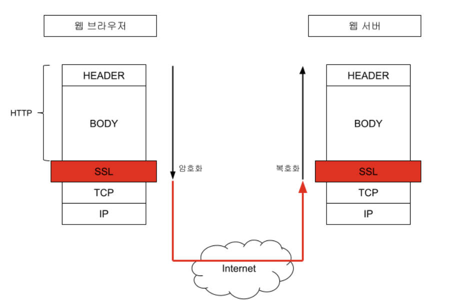

# HTTP HTTPS / DNS

[toc]

## 응용 계층 (7계층, Application) 

* 7계층 중 최상위 계층으로 사용자에게 직접 보이는 부분이며, 응용 프로세스와 직접 관계하여 일반적인 응용 서비스를 수행하는 계층
* 사용자가 OSI 환경에 접근할 수 있도록 서비스를 제공한다.
  * ex) 응용 포르세스간의 정보교환, 전자 사서함, 파일 전송 등

### 응용 계층의 주요 프로토콜

| 프로토콜 |                                     | 설명                                                         |
| -------- | ----------------------------------- | ------------------------------------------------------------ |
| FTP      | File Transfer P.                    | 컴퓨터와 컴퓨터 또는 컴퓨터와 인터넷 사이에서 파일을 주고받을 수 있도록 하는 원격 파일 전송 프로토콜 |
| SMTP     | Simple Mail Transfer P.             | 전자 우편을 교환하는 서비스                                  |
| TENLET   |                                     | 멀리 떨어져 있는 컴퓨터에 접속하여 자신의 컴퓨터처럼 사용할 수 있도록 해주는 서비스 프로그램을 실행한느 등 시스템 관리 작업을 할 수 있는 가상의 터미널 기능을 수행한다 |
| SNMP     | Simple Network Management P.        | TCP/IP의 네트워크 관리 프로토콜로, 라우터나 허브 등 네트워크 기기의 네트워크 정보를 네트워크 관리 시스템에 보내는 데 사용되는 표준 통신 규약 |
| **DNS**  | Domain Name System                  | 도메인 네임을 IP 주소로 매핑하는 시스템                      |
| **HTTP** | HyperText Transfer P.               | 월드 와이드 웹(WWW)에서 HTML 문서를 송수신하기 위한 표준 프로토콜 |
| MQTT     | Message Queuing Telemetry Transport | 발행-구독 기반의 메시징 프로토콜로, IoT 환경에서 주로 사용된다. |

## HTTP (HyperText Transfer Protocol)

* 웹 서버와 브라우저 사이에 하이퍼텍스트 문서를 교환하기 위해 사용되는 통신규약
* 1989년, 팀 버너스 리에 의해 처음 설계되어 인터넷을 통한 월드 와이드 웹(World Wide Web) 기반에서 전세계적인 정보 공유를 이루는데 큰 역할을 하였다.
  * 인터넷 주소를 지정할 때, `http://www.~`와 같이 시작되는 것은 `www.~`로 시작되는 인터넷 주소에서 하이퍼텍스트 문서의 교환을 http 통신규약으로 처리하라는 의미!
* 이름에서 알 수 있듯, HTTP는 텍스트 교환. HTML 페이지 또한 텍스트이다.
* 이렇게 단순 텍스트를 주고 받는 것이기 때문에, 네트워크 신호를 가로채어 본다면 내용이 노출될 수 있다. 
  * Private한 정보가 오가는 서비스들(전자 상거래, 전자 메일, 사내 문서)에서 사용하기 어렵다.

=> 이런 보안 이슈를 해결하기 위한 프로토콜이 **HTTPS**이다!

## HTTPS (HyperText Transfer Protocol over Secure Socket Layer)

* 소켓 통신에서 일반 텍스트를 사용하는 대신, SSL(Secure Socket Layer) (현, TLS: Transport Layer Security) 프로토콜을 이용하여 세션 데이터를 암호화하여 데이터를 주고 받는 통신규약
* 보안에서의 장점과 더불어, 검색 엔진 최적화에서도 큰 혜택을 볼 수 있다.
  * 검색 엔진 최적화: 특정 검색어를 검색했을 대 검색 순위가 비교적 앞에 배치되어 더 많은 유저가 이를 방문할 수 있도록 하는 것
  * http보다 https라면 더 사이트를 안전하다고 판단해 검색 순위를 앞으로 배치해준다.
* URI 형태: `https://`

### SSL (Secure Socket Layer, 보안 소켓 레이어)

* 전자상거래에서의 데이터 보안을 위해서 개발한 통신 레이어
* 서버와 브라우저 사이에 안전하게 암호화된 연결이 일어나도록 도와주어 민감한 정보가 도난당하지 않게 방지해주는 역할을 한다.
* 표현 계층의 프로토콜로, 응용 계층 아래에 있기 때문에 어떠한 응용 계층의 데이터라도 암호화해서 보낼 수 있다.
* 

### HTTPS의 암호화 원리: 공개키 암호화 방식

* 

  

* 공개키 암호화 기법(혹은 비대칭 암호화 기법)은 한 쌍의 키를 사용해서 하나는 암호화할 때 사용하고, 다른 하나는 복호화할 때 사용하는 암호화 기법이다.
* 한 쌍의 키 중 하나는 특정 사람만이 가지는 **개인키(S)**이고, 다른 하나는 누구나 가질 수 있는 **공개키(P)**라고 부른다.
* **S키로 암호화 -> 그 쌍이 되는 P키로만 복호화가 가능, **
  **P키로 암호화 -> 그 쌍이 되는 S키로만 복호화가 가능**

#### HTTPS 통신 흐름

* 공개키가 공개키 저장소에 있는데, 어떻게 가져오는가?
* 공개키 저장소: <u>CA(Certificate Authority),</u> 공개키를 저장해주는 신뢰성이 검증된 민간기업

* 

1. 먼저 애플리케이션 서버(A, 이하 <u>사이트</u>)를 운영하는 기업은 HTTPS를 적용하기 위해서 공개키와 개인키를 만듭니다.
2. 그 다음에 신뢰할 수 있는 CA 기업(이하 <u>인증기관</u>)을 선택하고 그 기업에 내 공개키를 관리해달라고 계약한다.
3. 계약을 완료한 인증기관 또한, 그 기업만의 공개키와 개인키가 있습니다.
   인증기관은 자신의 기업명과 A 사이트의 공개키, 공개키의 암호화 방법 등의 정보를 담은 인증서를 만들고, 해당 인증서를 인증기관의 개인키로 **암호화해서** A 사이트에게 제공합니다.
4. A 사이트는 암호화된 인증서를 갖게 되었습니다. 이제 A 사이트는 A 사이트의 공개키로 암호화된 HTTPS 요청이 아닌 요청이 오면 이 암호화된 인증서를 클라이언트(이하 <u>브라우저</u>)에게 줍니다.
5. 예를 들어 클라이언트가 A 사이트에게 index.html 파일을 요청했다고 가정한다면, 이는 HTTPS 요청이 아니기 때문에 **A 사이트의 정보를 인증기관의 개인키로 암호화한 인증서**를 클라이언트가 받게될 것이다.
6. 웹 브라우저에는 이미 세계적으로 신뢰할 수 있는 인증기관의 리스트와 그 공개키를 알고 있기 때문에, 브라우저가 인증기관 리스트를 탐색하면서 해당 기관을 찾아낸다면 그 기관의 공개키를 이용해 해독할 것이고, 해독한 내용에서 A 사이트의 공개키를 앋을 수 있게 된다.
7. 그러면 A 사이트와 통신할 때는 A 사이트의 공개키로 암호화해서 요청을 보낼 수 있게 되는 것이다.

> HTTPS라고 무조건 안전하지는 않다.
>
> why? 자체적으로 인증서를 발급할 수도 있고, 신뢰할 수 없는 CA 기업을 통해 인증서를 발급할 수도 있기 때문
> 이럴 경우, 브라우저에서는 `주의 요함`, `안전하지 않은 사이트` 등의 알림을 준다.

## DNS (Domain Name System)

* 인터넷은 2개의 주요 이름공간을 관리하는데, 하나는 **도메인 네임** 계층, 다른 하나는 **인터넷 프로토콜(IP) 주소** 공간이다. 
  도메인 이름(Domain Name): 숫자 형태의 IP 주소를 기억하기 쉽게하기 위해 부여된 이름 

  * |  **IP 주소**  |   **도메인 이름**    |
    | :-----------: | :------------------: |
    | 218.237.65.4  | www.hanbitbook.co.kr |
    | 203.237.202.6 |   www.jejue.ac.kr    |

    

* 

* 도메인 네임 시스템은 도메인 네임 계층을 관리하며 해당 네임 계층과 주소 공간 간의 변환 서비스를 제공한다. 흔히 "전화번호부"에 비유되는데, `www.example.com`과 같은 도메인 이름을 192.168.1.0과 같은 IP 주소로 변환하고 라우팅 정보를 제공하는 분산형 데이터베이스 시스템.

* DNS 서버는 이름에 대한 요청을 IP 주소로 변환하여 최종 사용자가 도메인 이름을 웹 브라우저에 입력할 때 해당 사용자를 어떤 서버에 연결할 것인지를 제어한다. 이 요청을 쿼리라고 한다.

### Domain 구조

- 인터넷상에서 사용되는 도메인은 전 세계적으로 고유하게 존재하는 이름으로, 정해진 규칙 및 체계에 따라야 하며 임의로 변경되거나 생성될 수 없다.
- 
- 인터넷상의 모든 도메인은 ".(dot)" 또는 루트(root)라 불리는 도메인 아래에 그림과 같이 나무를 거꾸로 위치시킨 역트리(Inverted tree)구조로 계층적으로 구성된다.
- 도메인 이름을 보면 `.`로 구분하여 계층화되어 있는데, 오른쪽으로 갈수록 상위 계층을 나타낸다.
  

### DNS 동작 원리 (Recursive Query)

1. 웹 브라우저에 도메인 이름(예: `www.hanbitbook.co.kr`)을 입력하면 먼저 Local DNS에게 해당 도메인에 대한 IP 주소를 질의한다. 이때, Local DNS에서 IP주소를 찾을 수 없다면 다른 DNS 서버에 질의(쿼리)하여 IP주소를 얻어낸다.
   

   
DNS 동작원리 사진

   
   

2. 
   도메인 구조에서 하위 계층의 도메인 이름에 대한 정보를 바로 위의 상위 계층의 DNS 서버에서 등록하여 관리한다. 즉 `www.hanbitbook.co.kr`의 정보는 바로 상위 계층인 `hanbitbook.co.kr`의 DNS 서버에서 등록하고, `hanbitbook.co.kr`의 정보는 `co.kr`의 DNS 서버에서 등록하고, `co.kr`의 정보는 `kr`의 DNS 서버에서 등록한다. 마지막으로 `kr`의 상위 계층인 루트 도메인에 `kr`의 정보를 등록하여 관리한다. 그리고 이런 루트 도메인에 대한 정보는 모든 DNS 서버에서 등록하여 관리한다.

3. Local DNS에서 다른 DNS에 질의를 할 때에는 최상위 즉 루트 DNS 서버에서부터 질의를 보내 정보(IP 주소)를 얻는다. **`<Recursive Query>`**
   * 루트 DNS 서버에게 질의 -> `kr`에 대한 정보 반환
   * `kr` DNS 서버에게 질의 -> `co.kr`에 대한 정보 반환
   * `co.kr` DNS 서버에게 질의 -> `hanbitbook.co.kr`에 대한 정보 반환
   * `hanbitbook.co.kr` DNS 서버에게 질의 -> `www.hanbitbook.co.kr`에 대한 정보(최종 IP주소) 반환

4. Local DNS는 `www.hanbitbook.co.kr`에 대한 IP주소를 캐싱하고 IP주소 정보 전달

 
   
Reference

    <ul>
      <li>
		<a href=" https://velog.io/@dlrbwls0302/%EC%BD%94%EB%94%A9-%ED%85%8C%EC%8A%A4%ED%8A%B8-%EC%A4%80%EB%B9%842021.04.29-1%EC%9D%BC%EC%B0%A8HTTP-Vs.-HTTPS">블로그 출처1</a>
	  </li>
      <li>
		<a href="https://jeong-pro.tistory.com/89">블로그 출처2</a>
	  </li>
      <li>
	  	<a href="https://pinelover.tistory.com/180">블로그 출처3</a>
	  </li>
	  <li>
	  	<a href="https://github.com/gyoogle/tech-interview-for-developer/blob/master/Computer%20Science/Network/HTTP%20%26%20HTTPS.md">깃헙 출처1</a>
	  </li>
      <li>
	  	<a href="https://terms.naver.com/entry.naver?docId=2270474&cid=51173&categoryId=51173">네이버 지식백과: 도메인 이름</a>
	  </li>
      <li>
	  	<a href="http://wiki.hash.kr/index.php?title=HTTPS&mobileaction=toggle_view_desktop#cite_note-2">해시넷 위키</a>
	  </li> 
      <li>길벗알앤디, 시나공 기본서 정보처리기사 필기, 길벗, 2022</li> 
    </ul>

