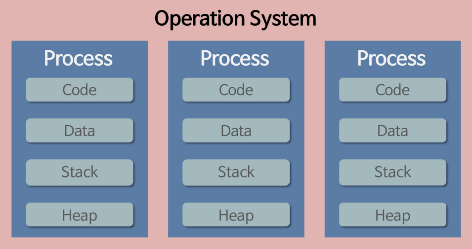
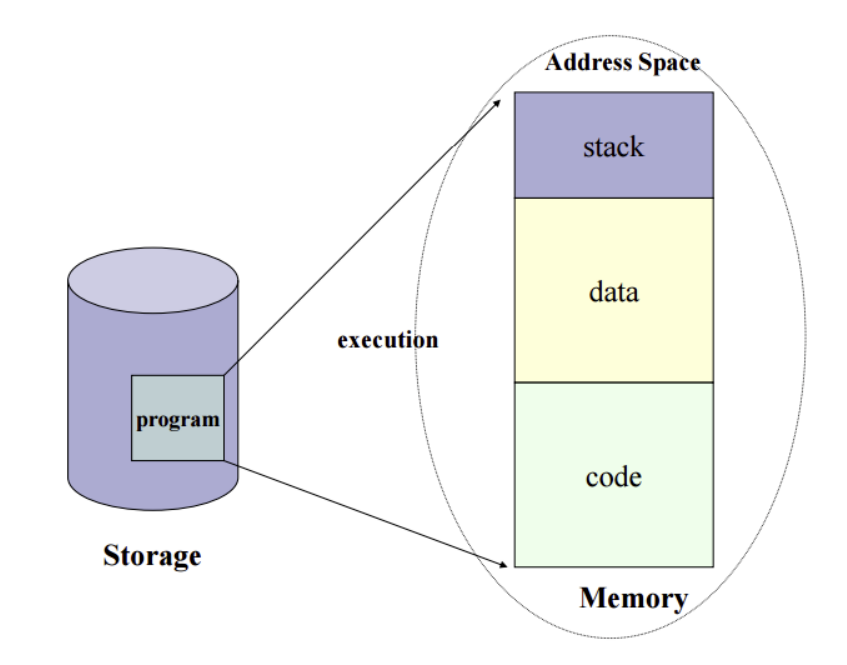
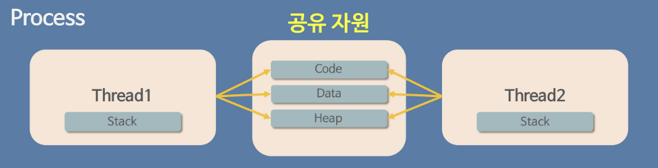

# 0615

> **운영체제(OS, Operating System)란?**
>
> 하드웨어를 관리하고, 컴퓨터 시스템의 자원들을 효율적으로 관리하며, 응용 프로그램과 하드웨어 간의 인터페이스로써 다른 응용 프로그램이 유용한 작업을 할 수 있도록 환경을 제공해준다.
>
> 즉, 운영 체제는 사용자가 컴퓨터를 편리하고 효과적으로 사용할 수 있도록 환경을 제공하는 시스템 소프트웨어라고 할 수 있다.
>
> **운영체제의 역할**
>
> 1. 프로세스 관리
> 2. 저장장치 관리
> 3. 네트워킹
> 4. 사용자 관리
> 5. 디바이스 드라이버

* **프로세스 관리**
  * 운영체제에서 작동하는 <u>응용 프로그램을 관리</u>하는 기능
  * 어떤 의미에서는 프로세서(CPU)를 관리하는 것이라고 볼 수 있다. 현재 CPU를 점유해야 할 프로세스를 결정하고, 실제로 CPU를 프로세스에 할당하며, 이 프로세스간 공유 자원 접근과 통신 등을 관리하게 된다.

* 프로그램이란 무엇인가?
  * 파일이 저장 장치에 저장되어 있지만, <u>메모리에는 올라가 있지 않은</u> <u>정적인 상태</u>를 의미
    * 메모리에 올라가 있지 않은: OS가 프로그램에게 독립적인 메모리 공간을 할당하지 않았다.
    * 정적인 상태: 아직 실행되지 않은 상태
  * 즉, 아직 실행되지 않은 파일 그 자체를 가리키는 것! -> 단순 **코드 덩어리**

* 프로그램이 실행되면 어떻게 되는가?
  * 프로그램 파일이 컴퓨터 메모리에 올라가게 된다.(동적인 상태), 이 상태의 프로그램을 **프로세스**라고 한다. 
  * 
  * *프로그램 -> 프로세스 -> 스레드*

## 프로세스 & 스레드

### 프로세스란?

* 정의
  * 컴퓨터에서 연속적으로 실행되고 있는 프로그램
  * 운영체제로부터 시스템 자원을 할당받는 작업의 단위 (OS 입장에서 최소 작업 단위)
* 특징
  * OS로부터 시스템 자원을 할당받는다.
    1. 주소 공간
    2. CPU 시간
    3. Code, Data, Stack, Heap 구조로 되어있는 독립적인 메모리 영역
  * 하나의 프로세스는 자신의 고유한 자원을 할당받고, 이 자원은 다른 프로세스와 공유되지 않는다.
  * 하나의 프로세스는 한 개 이상의 스레드를 가지고 있다.

#### 프로세스 주소 공간

* 프로그램이 실행되면 프로세스가 생성되고, 메모리에 그 프로세스의 주소공간(Address Space)가 할당되게 된다. 
* 주소공간은 Code, Data, Stack 부분으로 이뤄져 있다.
  * Code
    * 프로그램 소스 코드 -> CPU에서 수행할 수 있는 기계어로 변환되어 저장되는 공간
    * 함수 제어문 상수 등이 지정
    * READ-ONLY
  * Data: 
    * 프로그램이 사용하는 데이터(전역변수와 정적변수)를 저장하는 공간
    * 프로그램이 구동되는 동안 항상 접근 가능한 변수가 저장
    * READ-WRITE
  * Stack
    * 지역변수와 매개변수 저장, 호출된 함수의 수행을 마치고 복귀할 주소 및 데이터를 임시로 저장하는 공간
    * 함수의 호출이 완료되면 소멸
    * 컴파일 시 스택영역의 크기가 결정되기 때문에 무한정 할당할 수는 없다.

#### 프로세스의 구역을 나눈 이유는?

* 최대한 데이터를 공유하여 메모리 사용량을 줄이기 위함이다.
* Code는 같은 프로그램 자체에서 모두 같은 내용이기 때문에 따로 관리,

* Stack과 Data가 구분되는 이유는
  * 프로그램의 함수와 지역 변수는, LIFO(가장 나중에 들어간게 먼저 나옴)특성을 가진 스택에서 실행된다. 
    따라서 이 함수들 안에서 공통으로 사용하는 '전역 변수'는 따로 지정해주면 메모리를 아낄 수 있다.

### 스레드란?

* 정의
  * 프로세스 내에서 실행되는 흐름의 단위
  * (CPU 입장에서 최소 작업 단위)
* 특징
  * 하나의 프로세스 내의 주소 공간이나 자원을 공유
  * 스레드는 프로세스 내에서 Stack만 따로 할당받고, Code, Data, Heap 영역은 공유한다.
  * 하나의 프로세스는 여러개의 스레드를 가질 수 있다.

> 과거에는 프로그램을 실행할 때 하나의 프로세스만을 사용해도 됐었다. 그러나 시간이 흐르면서 프로그램이 복잡해졌고, 하나의 프로세스만으로 실행하기는 벅차졌다. 이를 해결한다고 생각해보면 쉽게 "한 프로그램을 처리하는 여러 프로세스를 만들면 되지 않나?"라고 생각할 수 있지만, 이는 불가능하다. 왜냐하면 OS는 안정성을 위해서 프로세스마다 독립된 메모리 영역을 할당했고, 이를 벗어난 영역에 접근하려면 오류가 발생하기 때문이다. 
>
> -> 그래서 프로세스와는 다른 더 작은 실행단위 개념이 필요했고, 이 개념이 바로 스레드이다.

### 멀티프로세스

* 두 개 이상의 다수의 프로세서(CPU)가 협력적으로 하나 이상의 작업(task)을 동시에 처리(병렬처리)하는 것 == `멀티태스킹`

#### 장점

1. 독립된 구조이기 때문에, 안정성이 높다!
2. 프로세스 중 하나에 문제가 생겨도 다른 프로세스에 영향을 주지 않는다 -> 작업 속도가 느려지는 손해는 있지만 정지되지는 않는다.

#### 단점

1. 독립된 메모리 영역이기 때문에, 작업량이 많을수록 오버헤드가 발생하여 성능저하가 발생할 수 있다.  

   > **오버헤드**
   >
   > 어떤 처리를 하기 위해 들어가는 간접적인 처리 시간이나 메모리 등을 의미

2. Context Switching으로 인한 성능 저하가 생길 수 있다.

   > **Context Switching**
   >
   > CPU는 한 번에 하나의 프로세스만 실행 가능한데, CPU에서 여러 프로세스를 돌아가면서 작업을 처리할 때 **프로세스의 상태 정보를 저장하고 복원하는 일련의 과정**을 의미한다.
   >
   > 구체적으로, 동작 중인 프로세스가 대기하면서 해당 프로세스의 상태를 보관하고, 대기하고 있던 다음 순서의 프로세스가 동작하면서 이전에 보관했던 프로세스의 상태를 복구하는 작업을 의미한다.

### 멀티스레드

* 하나의 응용 프로그램을 여러 개의 스레드로 구성하여 각 스레드가 하나의 작업을 처리하도록 하는 것

#### 장점

1. Context-Switching할 때 공유하고 있는 메모리만큼의 메모리 자원을 아낄 수 있다.
2. 스레드는 프로세스 내의 Stack 영역을 제외한 모든 메모리를 공유하기 때문에 통신의 부담이 적어서 응답 시간이 빠르다.

#### 단점

1. 스레드 하나가 프로세스 내 자원을 망쳐버린다면 다른 스레드가 종료될 수 있다.
2. 자원을 공유하기 때문에 필연적으로 **동기화 문제**가 발생할 수밖에 없다.
   * 동기화 문제: 여러 스레드가 함께 전역 변수를 사용할 경우 발생할 수 있는 충돌
3. 너무 많은 스레드의 사용은 오버헤드를 발생시킬 수 있다.

#### 멀티프로세스 대신 멀티스레드를 사용하는 이유는?

- 프로세스보다 자원 소모가 적고 자원을 효율적으로 관리할 수 있다.
- 프로세스는 Context Switcing 시 캐시 메모리도 초기화되어 오버헤드가 큰데, 스레드는 Stack만 처리해도 된다.  
- 프로세스간 통신(정보 접근)을 위해서는 IPC를 사용해야 하지만, 스레드는 자원 공유가 간단하다.

## 면접 예상 질문

1. 프로세스와 스레드의 차이에 대해 말해보라
2. 프로세스 주소 공간이 구별되어 있는 이유는 무엇인가?

#### Reference

* https://cocoon1787.tistory.com/688
* https://velog.io/@raejoonee/%ED%94%84%EB%A1%9C%EC%84%B8%EC%8A%A4%EC%99%80-%EC%8A%A4%EB%A0%88%EB%93%9C%EC%9D%98-%EC%B0%A8%EC%9D%B4
* https://gmlwjd9405.github.io/2018/09/14/process-vs-thread.html
* https://seongeun-it.tistory.com/181