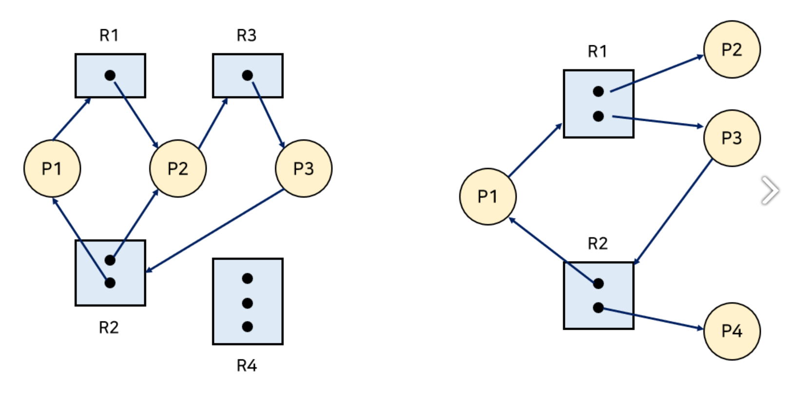
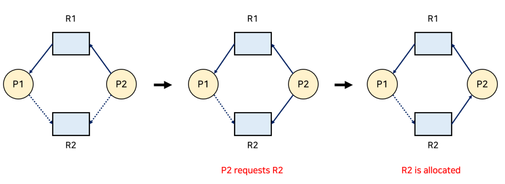
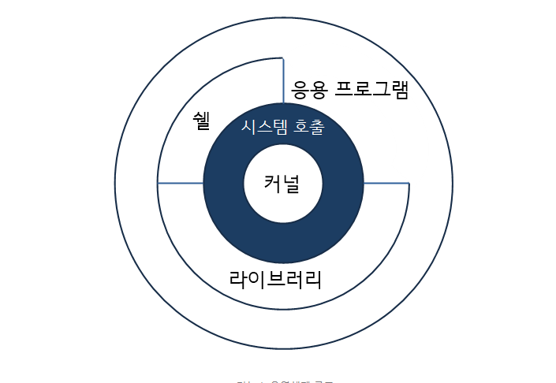
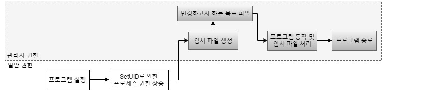

# 0622 DeadLock, Race condition


## 논의에 앞서서

- 프로그램 - 파일이 저장 장치에 저장되어 있지만,  OS가 프로그램에게 독립적인 메모리 공간을 할당하지 않아 실행되지 않은 상태

- 프로세스 - 프로그램이 컴퓨터 메모리를 할당받아 실행되고 있는 상태

- 따라서 프로세스는 반드시 OS로부터 시스템 자원을 할당받으며, 이는 주소 공간, CPU 시간, 메모리 영역으로 나뉘어진다. 만약, 시스템 자원을 할당받지 못하면???

- ```
  프로세스가 자원을 사용하는 절차에는 Request, Allocate, Use, Release가 있다. 
  Request :  자원을 요청한다. 만약 다른 프로세스가 자원을 사용하고 있다면 대기.(프로세스의 생명주기로는 ready(wait)에 해당한다) 
  Allocate : 자원을 할당받는다.(프로세스의 생명 주기로는 dispatch에 해당한다)
  Use : 프로세스가 자원을 사용하여 작업을 수행한다.(running)
  Release : 프로세스의 작업이 모두 끝나 자원을 반환한다.(terminate(작업이 완전히 끝났을 경우) 또는 waiting(이후 작업이 남은 경우))
  ```


## 데드락 (DeadLock, 교착 상태)

> 두 개 이상의 프로세스가 서로가 가진 자원을 기다리는 바람에 다음 처리를 하지 못하는 상태
>
> 시스템적으로 한정된 자원을 여러 곳에서 사용하려고 할 때 발생.


- 데드락이 일어나는 경우

[](https://camo.githubusercontent.com/a78df4477534741d6058a959e753fe82050589944c8801b4fc88c23d4696fcad/68747470733a2f2f74312e6461756d63646e2e6e65742f6366696c652f746973746f72792f323433453839333535373134433236453238)

프로세스1과 2가 자원1, 2를 모두 얻어야 하는데,

-  프로세스1이 자원1을 얻고  프로세스2가 자원2를 얻었다면

- 프로세스1은 프로세스2가 가진 자원2를 기다리고, 프로세스2 또한 프로세스 1이 가진 자원을 무한정 기다리게 된다./ 프로세스2는 자원1을 기다림
- 그 결과 두 프로세스는 모두 dispatch할 수 없으며,  자원을 요청하는 request 단계(ready)에서 멈추게 된다.
- 결국 ready 단계에 있는 두 프로세스로 인해, 다른 프로세스 또한 실행될 수 없는 상황을 **Deadlock**이라 한다.


### 발생 조건

> 네 조건이 모두 성립해야만 발생하므로, 해결 방법도 이 조건을 완화하는 방식임  

1. ##### 상호 배제(Mutual exclusion)

   > 매 순간 하나의 프로세스만이 자원을 사용할 수 있음

2. ##### 점유 대기(Hold and wait)

   > 자원을 가진 프로세스가 다른 자원을 기다릴 때, 보유하고 있는 자원을 놓지 않고 계속 가지고 있어야만 함

3. ##### 비선점(No preemption)

   > 다른 프로세스에 할당된 자원은 사용이 끝날 때까지 강제로 빼앗을 수 없음(OS에 의해 강제로 자원을 빼앗기지 않아야 함)

4. ##### 순환 대기(Circular wait)

   > 프로세스의 집합에서 순환 형태로 자원을 대기하고 있어야 함(p1, p2, p3이 있다면, p1이 p2를, p2가 p3을, p3이 p1을 기다려야 한다.)
   >
   > ```
   > 프로세스 간의 관계를 그래프로 도식화해 보면 데드락이 발생할지 예상할 수 있다. 이 그래프는 자원 할당 그래프
   > 
   > R은 자원이고 P는 프로세스를 의미한다. 자원 내의 동그라미는 자원(인스턴스)의 개수이다. 
   > 자원 → 프로세스로 향하는 간선은 해당 자원을 프로세스가 보유 중(Allocate)이라는 의미이고, 프로세스 → 자원으로 향하는 간선은 프로세스가 해당 자원을 요청(Request)했다는 의미. 
   >  
   > 만약 그래프에 사이클(Cycle)이 없다면 Deadlock이 아니다. 반면, 사이클이 있다면 Deadlock이 발생할 수 있다.(이는 상황에 따라 다르게 된다.) 
   > 정확히 말하면, 자원당 하나의 인스턴스만 있는 경우엔 Deadlock이고, 여러 인스턴스가 존재하는 경우엔 Deadlock일 수도 있고 아닐 수도 있다. 
   > ```



### 데드락(DeadLock) 해결 방법

#### 1. 예방(prevention) - 예방책

교착 상태 발생 조건 중 어느 하나를 만족하지 않도록 하여 해결함 

> - 상호배제 부정 : 공유 자원이 존재
> - 점유대기 부정 : 프로세스가 지원을 요청할 때 어떤 자원도 가지고 있지 않는 경우. 자원이 있을 시 모두 반환하고 재요청하거나 모든 자원을 한번에 할당
> - 비선점 부정 : 자원 점유 중인 프로세스가 다른 자원을 요구할 때 가진 자원 반납(즉 OS에서 자원을 강제로 뺏어감)
> - 순환대기 부정 : 자원의 타입마다 프로세스마다 정해진 순서대로 자원 요구


#### 2. 회피(avoidance) - 예방책

Deadlock이 발생할 가능성이 있는 경우엔 아예 자원을 할당하지 않는 방식, ex) 프로세스들이 필요로 하는 자원을 미리 선언

Safe Sequence : 프로세스의 sequence <P1, P2, ..., Pn>이 있을 때, Pi의 자원 요청이 '가용 자원 + 모든 Pj (j < i)의 보유 자원'에 의해 충족된 sequence


> 은행원 알고리즘(Banker's Algorithm) - 자원 타입마다 여러 인스턴스가 존재하는 경우에 사용
>
> - dijkstra가 고안한 알고리즘이며, 이는 프로세스가 자원을 요청할 때마다 수행
>
> - 은행에서 모든 고객의 요구가 충족되도록 현금을 할당하는데서 유래함
> - 모든 프로세스는 자원의 최대 사용량을 미리 명시하고, 요청 자원을 모두 할당받으면 정해진 시간 안에 자원들을 다시 반납
> - 요청 자원의 수가 남은 자원의 수보다 적은 프로세스만 선택하여 수행(이 경우가 **safe** 상태)
> - 안정 상태면 프로세스는 자원 할당받고 작업이 모두 끝나면 자원을 모두 반환,  불안정 상태 일시 다른 프로세스들이 자원 해지까지 대기


Resource Allocation Graph Algorithm (자원 할당 그래프 알고리즘) - 자원 타입마다 하나의 인스턴스만 존재하는 경우에 사용

- 점선으로 표시된 간선(Claim edge)은 프로세스가 자원을 미래에 요청할 수 있음을 의미

- 그리고 해당 자원을 요청하는 경우 실선(Request edge)으로 변화.
- 자원을 할당받으면 방향이 반대인 간선(Assignment edge)으로 변화.
- 자원을 반환하면 claim edge로 변화
- 모든 점선이 사이클을 이루지 않는 경우에만 요청 자원을 할당





#### 3. 교착 상태를 탐지 & 회복(Detection and Recovery) - 사후책

교착 상태가 되도록 허용한 다음 회복시키는 방법

1. ##### 탐지(Detection)

   자원 할당 그래프를 통해 교착 상태를 탐지함

   자원 요청 시, 탐지 알고리즘을 실행시켜 그에 대한 오버헤드 발생함

2. ##### 회복(Recovery)

   교착 상태 일으킨 프로세스를 종료하거나, 할당된 자원을 해제시켜 회복시키는 방법

   > ##### 프로세스 종료 방법
   >
   > - 교착 상태의 프로세스를 모두 중지
   > - 교착 상태가 제거될 때까지 하나씩 프로세스 중지
   >
   > ##### 자원 선점 방법 - 프로세스 종료시킬지 결정 후(selecting a victim) 발생하기 전 상태로 프로세스 재시작(rollback)
   >
   > - 교착 상태의 프로세스가 점유하고 있는 자원을 선점해 다른 프로세스에게 할당 (교착 상태의 프로세스를 강제로 중지하며, 자원을 반환하게 함)
   > - 우선 순위가 낮은 프로세스나 수행 횟수 적은 프로세스 위주로 자원 선점
   > - 단 같은 프로세스가 계속 종료될 경우(victim) 필요한 자원이 만성적으로 부족한 starvation 발생할 수 있음


### 4. 무시 - 사후책

- Deadlock 아예 일어나지 않는다고 가정 후 조치 자체를 취하지 않음
- 조치 자체가 오히려 오버헤드(프로그램의 실행흐름 도중에 동떨어진 위치의 코드를 실행시켜야 할 때 , 추가적으로 시간,메모리,자원이 사용되는 현상) 발생할 수 있기 때문
- 현재 범용 운영체제 모두 채택하는 방식


## 리눅스 간략 설명



- 커널 - 항상 메모리에 상주하여 CPU, 메인 메모리, 하드디스크 등의 하드웨어 자원을 제어하면서 프로세스 스케줄링, 기억장치 관리, 파일 관리, 시스템콜 기능을 제공한다.

- 시스템 호출 - 사용자 프로그램이 커널에 접근하는 인터페이스를 제공

- 쉘 - 운영체제와 사용자가 대화하기 위한 기반을 제공하는 프로그램, 명령어 해석기 

- **1. 파일의 접근 권한 설명**

  > **1) 읽기(r)** : 파일의 내용을 볼 수 있다.
  >
  > **2) 쓰기(w)** : 파일의 내용을 변경할 수 있고, 파일의 이름을 변경하거나 삭제할 수 있다.
  >
  > **3) 실행(x)** : 파일을 실행할 수 있다. 

  **2. 디렉터리의 접근 권한 설명**

  > **1) 읽기(r)** : 디렉터리의 파일, 서브 디렉터리 목록을 볼 수 있다. 
  >
  > **2) 쓰기(w)** : 디렉터리에 파일, 서브 디렉터리를 생성하거나 삭제할 수 있다.
  >
  > **3) 실행(x)** : cd 명령어를 이용해서 디렉터리 또는 서브 디렉터리로 이동할 수 있고, 디렉터리에서 프로그램을 실행 할 수 있다. 그리고 파일의 메타정보를 볼 수 있다.
  >
  > **setuid** - 이 비트가 설정되어 있을 경우, 프로그램이 실행되었을 때는 **이 프로그램의 소유주**의 권한으로 상승하여 실행됨. 

  **3. 리눅스 파일의 종류**

  > 리눅스 파일의 종류는 ls -l 명령어를 통해 확인이 가능하며 접근 권한의 맨 앞자리에 표시된다.
  >
  > 이 경우 파일의 권한은 644/디렉터리의 권한은 755로 뜻은 파일의 관리자(이때는 파일. 디렉터리의 주인은 root/그룹의 주인은 root 그룹)에게는 모든 권한을/ 그룹에 속한 계정은 읽기와 실행 권한을/ 일반 사용자는 읽기와 실행을 할 수 있다.
  >
  > **일반 파일(-)** : 텍스트, 이미지, 실행파일 과 같은 일반적인 파일
  >
  > **디렉터리 파일(d)** : 
  >
  > **심볼릭 링크(l)** : 소프트 링크라고도 하며, 절대 경로 또는 상대 경로를 이용해서 파일이나 디렉터리의 링크 정보만 가짐.
  >
  > **하드 링크** : 원본 파일과 완전히 똑같이 복사한 파일, 하드 링크 파일 변경 시 원본도 변경되고, 원본이 삭제되더라도 링크의 숫자만 줄어들고 그대로 유지됨

  

  

## Race Condition

공유 자원에 대해 여러 프로세스가 동시에 접근할 때,  접근하는 순서에 따라 비정상적인 결과를 발생하는 상황


#### Race Condition이 발생하는 경우

1. ##### 커널 작업을 수행하는 중에 인터럽트 발생

   - 문제점 : 커널모드에서 데이터를 로드하여 작업을 수행하다 인터럽트가 발생
   - 해결법 : 커널모드에서 작업을 수행하는 동안에는 인터럽트를 disable.

2. ##### 프로세스가 'System Call'을 하여 커널 모드로 진입하여 작업을 수행하는 도중 문맥 교환이 발생할 때

   - 문제점 : 프로세스1이 커널모드에서 데이터를 조작하는 도중, 시간이 초과되어 CPU 제어권이 프로세스2로 넘어가 같은 데이터를 조작하는 경우 
   - 해결법 : 시간이 초과되어도 CPU 제어권이 다른 프로세스에게 넘어가지 않도록 함

3. ##### 멀티 프로세서 환경에서 공유 메모리 내의 커널 데이터에 접근할 때

   - 문제점 : 멀티 프로세서 환경에서 2개의 CPU가 동시에 커널 내부의 공유 데이터에 접근하여 조작하는 경우
   - 해결법 : 공유 데이터에 접근할 때마다, 그 데이터에 대한 lock/unlock을 하는 방법


#### 레이스 컨디션 공격

1. 조건

   - 실행되는 프로세스가 특정한 임시파일을 만들고, 이를 끼어들 수 있음
   - 임시파일을 목적파일로 **심볼릭 링크**를 통해 연결할 수 있음(임시파일의 이름을 알고 있음)
   - **파일의 소유자가 root이고, setuid 설정이 되어 있는 경우**

2. 과정

   

   - 가정 - 프로그램 실행 시 임시 파일이 만들어지고, 이를 실행한 후 프로그램이 종료된다.(ex)보안 진단 시 bash 쉘을 사용하는데, 진단 결과 파일이 만들어지고, 이를 바탕으로 보안 취약점을 고치는 자동화 도구가 있다.)
   - 일반 사용자 neo가 파일의 소유주가 root이며 setuid가 설정된 파일을 실행하면, 프로세스의 권한은 root로 상승한다.
   - 프로세스의 중간 과정의 결과로 임시 파일이 생성된다. 
   - 해커는 임시 파일을 삭제하고, 자신의 해킹툴이 있는 파일을 임시 파일에 심볼릭 링크한다.
   - 그 결과 프로세스는 해킹 툴이 있는 파일을 임시 파일 대신에 실행하게 되고, 해킹툴이 실행되게 된다.
   - 프로세스는 종료된다.

3. 해결방법

   - 권한 설정과 링크 설정 여부를 검사한다
   - umask 설정을 022 이상으로 설정한다.
   - 가급적이면 특수권한을 사용하지 않는다.


## 출처

2021 정보보안기사 필기(탑스핏)

https://rebro.kr/177 [Rebro의 코딩 일기장:티스토리]

https://bamdule.tistory.com/169

https://d4m0n.tistory.com/3

https://github.com/gyoogle/tech-interview-for-developer/blob/master/Computer%20Science/Operating%20System/Race%20Condition.md