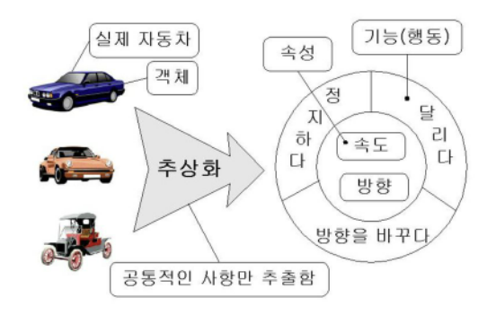

[toc]

# 객체 지향 프로그래밍(Object-Oriented Programming)

## 절차 지향 프로그래밍(구조적 프로그래밍)

* 프로시저에 근간을 두고 하나의 커다란 작업을 여러 개의 작은 작업으로 분할하고, 분할된 각각의 소작업을 수행하는 모듈을 작성한 다음 이들을 한 곳에 모아 큰 작업을 수행하는 하나의 완벽한 프로그램으로 작성하는 기법
* 문제점:
  * 유지보수는 고려하지 않고 개발 공정에만 너무 집중한다.
  * 개발이 시작된 이후 추가적인 요구사항에 대응하기 어렵다
  * 재사용이 어려워 이전과 유사한 새로운 SW를 다시 개발할 때에도 시간과 인력이 소모된다.

**구조적 기법의 문제점에 대한 해결책으로 채택된 것이 객체지향프로그래밍(OOP)이다.**

## 객체지향의 개요

* 객체지향이란..

  * 컴퓨터 프로그래밍 패러다임 중 하나로, 프로그래밍에서 필요한 데이터를 추상화시켜 상태와 행위를 가진 객체를 만들고 그 객체들 간의 유기적인 상호작용을 통해 로직을 구성하는 기법이다.

  * 

    > 현실 세계에서 개체들이 모여서 하나의 환경을 이루듯, 기계의 부품들을 하나의 객체로 만들고 이를 조립해 제품을 만드는 것처럼 SW를 개발하는 것!

* 객체지향의 장점

  * SW의 재사용 및 확장이 용이해 고품질의 SW를 빠르게 개발할 수 있고 유지보수가 쉽다.
  * 복잡한 구조를 단계적/계층적으로 표현하고, 멀티미디어 데이터 및 병렬 처리를 지원한다. -> 대형 프로젝트에 적합
  * 현실 세계를 모형화하므로 사용자와 개발자가 쉽게 이해할 수 있다.

* 객체지향의 주요 구성 요소 및 개념
  * 객체, 클래스, 캡슐화, 상속, 다형성, 연관성

## 구성 요소

### 객체(Object)

* 객체: 데이터와 데이터를 처리하는 함수를 묶어 놓은(캡슐화한) 하나의 SW 모듈
  * 데이터: 객체가 가지고 있는 정보
  * 함수: 객체가 수행하는 기능으로써 객체가 갖는 데이터를 처리하는 알고리즘
* 특징
  * 독립적으로 식별 가능한 이름을 가지고 있다
  * 객체가 가질 수 있는 조건을 상태(state)라고 하는데, 일반적으로 상태는 시간에 따라 변한다
  * 객체와 객체는 상호 연관성에 의한 관계가 형성된다
  * 객체가 반응할 수 있는 메시지의 집합을 행위라고 하는데, 객체는 행위의 특징을 나타낼 수 있다.
  * 객체는 일정한 기억장소를 가지고 있다.
  * 객체의 메소드는 다른 객체로부터 메시지를 받았을 때 정해진 기능을 수행한다.
  * 

### 클래스(Class)

* 클래스: 공통된 속성(attribute)과 행위(method)을 갖는 객체의 집합으로, 객체의 일반적인 타입을 의미한다.

  > 객체를 만들기 위한 메타정보라고 볼 수 있다. 

* 특징
  * 클래스는 각각의 객체들이 갖는 속성과 연산을 정의하고 있는 틀
  * OOP에서 데이터를 추상화하는 단위가 된다.
  * 동일 클래스에 속한 각각의 객체(인스턴스)들은 공통된 속성과 행위를 가지고 있으면서, 그 속성에 대한 정보가 서로 달라서 동일 기능을 하는 여러 가지 객체를 나타내게 된다.

### 추상화(Abstraction)

* 추상화: (클래스를 설계하기 위해) 공통의 속성이나 행위을 추출하는 것
* 왜 필요한가?
  * 

### 캡슐화(Encapsulation) 

* 캡슐화란
  * 데이터와 데이터를 처리하는 함수를 하나로 묶는 것
* 특징이자 목적
  * 캡슐화된 객체들은 재사용이 용이하다.
  
    > 속성과 행위를 클래스라는 캡슐에 넣는다고 생각! 
  * 캡슐화된 객체는 인터페이스를 제외한 정보가 은닉되고 외부에서의 접근이 제한된다. 
  
    > 그래서 외부 모듈의 변경으로 인한 파급 효과가 적고, 코드 수정이 일어났을 때 책임이 있는 객체만 수정하면 된다. 

### 상속(Inheritance)

* 상속이란
  * 이미 정의된 상위 클래스(부모 클래스)의 모든 속성과 연산을 하위 클래스(자식 클래스)가 물려받는 것
* 특징
  * 하위 클래스는 상위 클래스로부터 상속받은 속성과 연산 외에 새로운 속성과 연산을 첨가하여 사용할 수 있다.
  * 상위 클래스 속성과 연산을 하위 클래스가 사용할 수 있다는 특징으로 인해, SW의 재사용을 높이는 중요한 개념이 된다.

### 다형성(Polymorphism)

* 다형성이란

  * 메시지에 의해 겍체가 연산을 수행하게 될 때 하나의 메시지에 대해 각각의 객체가 가지고 있는 고유한 방법으로 응답할 수 있는 능력

  * > 다형성 == 여러 가지 형태를 가지고 있다.
    >
    > 즉, 하나의 속성 혹은 메소드를 호출했을 때 상황에 따라 다른 의미로 해석될 수 있다.

* 오버라이딩(Overriding): 부모 클래스로부터 상속받은 메소드를 재정의하는 것

* 오버로딩(Overloading): 하나의 클래스 안에 같은 이름의 메소드를 여러개 지닐 수 있다. (*python에서는 지원되지 않음*)

## 객체 지향 분석

> 사용자의 요구사항을 분석해서 요구된 문제와 고나련된 모든 클래스, 속성과 연산, 관계 등을 정의해서 모델링하는 작업
>
> 객체를 클래스로부터 인스턴스화하고, 이 클래스를 식별하는 것이 분석의 주요 목적

1. Rumbaugh(럼바우) 방법
   * 가장 일반적으로 사용되는 방법으로 분석 활동을 객체 모델, 동적 모델, 기능 모델로 나누어 수행하는 방법
   * 모든 SW 구성 요소를 그래픽 표기법을 이용해 모델링한다.

2. Booch(부치) 방법
   * 미시적 개발 프로세스와 거시적 개발 프로세스를 모두 사용하는 분석 방법, 클래스와 객체들을 분석 및 식별하고 클래스의 속성과 연산을 정의한다.

3. Jacobson 방법
   * Use Case(사용사례)를 강조하여 사용하는 분석 방법

4. Coad와 Yourdon 방법
   * ERD를 사용하여 객체의 행위를 모델링하며, 객체 식별, 구조 식별, 주제 정의, 속성과 인스턴스 연결 정의, 연산과 메시지 연결 정의 등의 과정으로 구성하는 기법

5. Wirfs-Brock 방법
   * 분석과 설계 간의 구분이 없고, 고객 명세서를 평가해서 설계 작업까지 연속적으로 수행하는 기법

## 객체 지향 설계

### 객체 지향 설계 과정

- 제공해야 할 기능을 찾고 세분화한다. 그리고 그 기능을 알맞은 객체에 할당한다.
- 기능을 구현하는데 필요한 데이터를 객체에 추가한다.
- 그 데이터를 이용하는 기능을 넣는다.
- 기능은 최대한 캡슐화하여 구현한다.
- 객체 간에 어떻게 메소드 요청을 주고받을 지 결정한다.

### 객체 지향 설계 원칙

SOLID라고 부르는 5가지 설계 원칙이 존재한다.

1. SRP(Single Responsibility) - 단일 책임 원칙

   * <u>객체(클래스)는 단 하나의 책임만 가져야 한다.</u>
   * 클래스를 변경하는 이유는 단 한개여야 한다. 이를 지키지 않으면, 한 책임의 변경에 의해 다른 책임과 관련된 코드에 영향을 끼칠 수 있다.
   * 결론적으로 응집도는 높고, 결합도는 낮게 설계하는 것을 의미한다.

2. OCP(Open-Closed) - 개방-폐쇄 원칙

   * <u>기존의 코드를 변경하지 않고 기능을 추가할 수 있도록 설계해야 한다.</u>
   * 확장에는 열려 있어야 하고, 변경에는 닫혀 있어야 한다.
   * 공통 인터페이스를 하나의 인터페이스로 묶어 캡슐화하는 방법이 대표적이다.

3. LSP(Liskov Substitution) - 리스코프 치환 원칙

   * <u>자식 클래스는 최소한 자신의 부모 클래스에서 가능한 행위는 수행할 수 있어야 한다.</u>

     > 즉, 상위 클래스의 객체를 하위 클래스의 객체로 치환해도, 상위 클래스에서 가능한 행위가 정상적으로 동작해야 한다.

   * 자식 클래스는 부모 클래스의 책임을 무시하거나 재정의하지 않고 확장만 수행하도록 해야 한다.

4. ISP(Interface Segregation) - 인터페이스 분리 원칙

   * <u>자신이 사용하지 않는 인터페이스와 의존 관계를 맺거나 영향을 받지 않아야 한다.</u>
   * 각 클라이언트가 필요로 하는 인터페이스들을 분리함으로써, 각 클라이언트가 사용하지 않는 인터페이스에 변경이 발생하더라도 영향을 받지 않도록 만들어야 한다.
   * 단일 책임 원칙이 객체가 갖는 하나의 책임이라면, 인터페이스 분리 원칙은 인터페이스가 갖는 하나의 책임이다.

5. DIP(Dependency Inversion) - 의존 역전 원칙

   * <u>각 객체들 간의 의존 관계가 성립될 때, 추상성이 낮은 클래스보다 추상성이 높은 클래스와 의존 관계를 맺어야 한다.</u>
   * 추상성이 낮은 모듈(저수준 모듈)이 추상성이 높은 모듈(고수준 모듈)에 의존해야 하며, 이렇게 되면 저수준 모듈이 변경되어도 고수준 모듈은 변경할 필요가 없다.

## 퀴즈

1. 객체 지향 프로그래밍이 무엇인지 설명하고, 캡슐화라는 특징으로 얻는 이점을 기술하시오

   > 프로그래밍에서 필요한 데이터를 추상화시켜 상태와 행위를 가진 객체를 만들고 그 객체들 간의 유기적인 상호작용을 통해 로직을 구성하는 기법이다. 추상화, 다형성, 캡슐화 등의 특징을 갖고 있으며 캡슐화를 통해 객체를 재사용하기 쉽고 정보를 은닉할 수 있다.

2. 객체 지향 분석 기법중 럼바우 기법의 대표적인 특징을 설명하시오

   > 모든  SW 구성 요소를 그래픽 표기법을 이용해 모델링하는 기법으로, 객체 모델링 -> 동적 모델링 -> 기능 모델링 순서로 분석활동이 이뤄진다.

 
   
Reference

    <ul>
      <li>https://jeong-pro.tistory.com/95</li>
	  <li>https://slidesplayer.org/slide/15273088/</li>
      <li>https://github.com/gyoogle/tech-interview-for-developer/blob/master/Computer%20Science/Software%20Engineering/Object-Oriented%20Programming.md</li>
      <li>길벗알앤디, 시나공 기본서 정보처리기사 필기, 길벗, 2022</li> 
    </ul>

